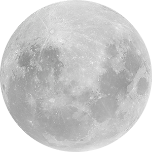

# the little prince

最初，在信笔闲涂时，总会为调不出心想的那一抹颜色而心情烦躁。
BUT。
现在。
我可以正式的说。
这个问题依旧存在 U.U

但是。
在完全解释缘由，揭示现状之前，容我先回忆一遍最初的历程。

---

## 如何使用

1. 下载压缩包
2. 打开 "./dist" 文件夹
3. 打开 "index.html"
4. 注意请用火狐浏览器打开，chrome有跨域访问限制，会影响webworker调用

## Requirements
You only need <b>node.js</b> pre-installed and you’re good to go. 

If you don’t want to work with lodash, just remove it from the node packages and the webpack config.

## Download
Download in current directory
```sh
$ curl -L -o master.zip https://github.com/cvgellhorn/webpack-boilerplate/archive/master.zip && unzip master.zip && rm master.zip && mv ./webpack-boilerplate-master/{.,}* ./ && rm -r ./webpack-boilerplate-master
```

## Setup
Install dependencies
```sh
$ npm install
```

## Development
Run the local webpack-dev-server with livereload and autocompile on [http://localhost:8080/](http://localhost:8080/)
```sh
$ npm run dev
```
## Deployment
Build the current application
```sh
$ npm run build
```

---

## [webpack](https://webpack.js.org/)
If you're not familiar with webpack, the [webpack-dev-server](https://webpack.js.org/configuration/dev-server/) will serve the static files in your build folder and watch your source files for changes.
When changes are made the bundle will be recompiled. This modified bundle is served from memory at the relative path specified in publicPath.

# 最初的想法


这是最初的想法，这个想法起源于照片调色，照片调色的核心是[光色互补原理](https://baike.baidu.com/item/%E4%BA%92%E8%A1%A5%E8%89%B2/3198044?fr=aladdin)，举个例子就像是我想去北极玩，按照正常思维应该先去买许多御寒的衣服，装备上齐全的设备，在物色一位风趣能干的导游，然后......，但其实正确的方法是先挣钱，没钱拿什么去北极（真实）。

所以这个道理同样适用于调色，有首歌唱得好：”你说的黑不是黑，你要的白是什么白“，大抵说的就是这意思吧（鲁迅说过）。

如图，当我想把一个很灰的蓝（五颜六色的黑）变得更蓝，一般而言现有的调色面板支持我们增加RGB中的B（blue）的分量，这会得到偏紫的蓝色，而不是宝蓝色，更不是天蓝色；而在HSB面板中，直接调整Hue和Saturation，按照脑海中的方向前进，会得到一个很漂亮的紫色~~（漂亮个屁）~~ 。

但当我尝试光色混合，确实是可以直接获得想要的颜色，但是调整方法很不直观，特别是这需要C、M、Y、K四个值同时变动，这大大的不是良民。

---

# 尝试一：扩展面板


这就是第一次尝试，就是把CMYK这四个值做进原有的面板里，显然，这大大的不行，首先观感不能，特别是饱和度面板，从左向右饱和度减少的模式非常吃藕chou！

**问题： 丑、难以使用、老瓶装新醋~**

---

# 尝试二：颜料圈混合


1. 获得初始的两个颜色
2. 拖动其中一个颜色向另一个颜色缓缓靠近
3. 当被拖动的色环进入静止色环50%及更少时，混色为“ 静止颜色 * 100% + 移动颜色 * x% ”
4. 当进入超过 r / 2 既超过50%时，混合颜色为“ 移动颜色 * 100% + 静止颜色 * （x - 50）% ”

总而言之，就相当于是把一种颜料缓缓滴入另一种颜料内，当然，整个过程是可回溯的，不会出现什么一块黑颜料掉进一个白颜料什么的惨剧，对，就是惨剧U.U

**问题：初次使用难以上手，需要非常大的面板支持，没有使用趣味性**

--- 

# 尝试三：曲线调色器

到这一步，设计就变得非常实用化了，色环中的圆圈显示初始颜色和当前颜色所在的位置，帮助更好掌握颜色的构成。
在启动时，调整曲线在R G B三个位置均有一个控制点，控制点可加可删。
当你拖动以有或者新创建的点，即意味着向调色盘内增加该点所对应的颜色；当你拖动线，既意味着整体饱和度的调整；当你拖动内部的圆环，则意味着亮度的调整。

**这是一个设计的转折点！设计思路起源于Pr的LUmetri color界面**

因为在这里，“RGB调色”和“HSB调色”被混合使用了，在增减颜料，既我们所说的 “变得更蓝”、“更红一点” 时，我们按照对应颜料量增减来实现颜色变化。但当说到 “ 颜色更亮”、“颜色更透” 就是饱和度（HSB里的S）和亮度（Brighensss）在起作用了。

PS：部分软件内使用HSV（V指代Volum），这里用的还是Brightness，更直观一点的啦！

**问题：趣味性不存在的，变成了非常具有 ‘ 插件感 ’ 的生产力工具，当然不是因为编这个太难了，咳咳**


---

# 尝试四：拟物化 - 工具台调色

于是乎，经过七天七夜，七七四十九天，我们从毛里求斯的椰子树上找到了灵感（没有）。
最终我们还是决定把这个App做的更加有趣一点，设想一下，当在旅途的你，打开了一个精致的便当盒子，就像这样。


每一片食物，都像玩具般有趣，恨不得全拨弄一遍，于是乎，抱着靠近那样的趣味感的想法，我们设计出来更新后的第一版设计，就是开始的那张图。

1. 左侧的三大支颜料，对应简易R G B调色，中心色块的大小会显示颜料的多少
2. 右侧的颜料环，表示高级补色调色环，原理同前所述的照片调色
3. 桌面上的各种工具，各有其用。比如圆规，我可以将圆规拿起，调整它的开合角度，从而控制在 “ 草稿纸 ” 工具上试色时的画笔大小，诸如此类，尽量还原一种杂而不乱的工具台的风格。

**问题：其实这一版已经完成了几乎所有的编程和大多数的设计绘制工作，但在最后的体验中，发现没有办法体现出那种随意放置的感觉，毕竟时鼠标操控，特别是右侧补色调色台，颜料的放置过于拘谨，影响整体设计风格**

**在几天的讨论后，我们最终还是决定放弃先前代码的50%和设计工作的90%，推翻重来，这也导致了后期工期较赶的问题，诶，哇啦啦啦啦啦啦 U.U**

---

# 尝试五（最终版）：卡通风 - 小王子星球调色器

## 设计参照

这是原著的小王子。最后的设计很多参考自原著，所以味道还是比较正的~ 嘿嘿

这是一幅同人作品。

## 第一版

第一版主要是试试效果，整个界面还是很粗糙的（因为是我画的，或者PS扣的），不过就氛围而言还是有点意思的，所以决定继续加工。

## 第二版


第二版主要是尝试动效，比如月亮的阴晴圆缺，星球的转动，星光闪烁的效果以及背景星空的周期运行。
测试效果尚可，这才决定继续细化。

## 第三版


第三版，也就是现在的版本。来简单介绍一下功能吧。

1. 月球：当前颜色显示器，月相的变化对应色相（0 ~ 360°），当颜色改变时，月相也会随之改变，以一种动画的方式。

2. 星星：亮度调节器，点击星星，星光会由明至暗，这回直接调整当前颜料颜色的亮度，并反应在月球上


3. 画板：点击画板可以进入试色界面，颜色会随之慢慢变淡
 
4. 星球与小王子：点击小王子，星球会随之转动，同时小王子的跑动特效开始播放，背景的星空也开始移动。星球内部有可用颜色的颜料，点击有动画，同时，内部的时钟指针表示当前颜色的所属范围，体验即可知哦~

以上就是软件的简单说明，在设计之初还有非常多的奇思妙想，但时间原因无法一一实现，只能待日后有空闲时（真的有么？）再继续加工完成。
其中一点就是关于星星，要是整个页面使用游戏引擎来做，那是这个星星可以是真的悬挂在一根线上，真的可以用鼠标托起来，让星星蹦蹦跳跳的（橡皮筋么这？？），或者是用支持虚拟现实的Aframe开发，等等。

---

## 技术总结

#### 总结所用技术，以月球的实现为主

按照文档的要求来，首先是关于代码行数，小组总共三人，制作成品两个。

### 项目一：CopyBoard

这个是最初的制作，因为被毙了（咳咳），但是关于调色的问题是从这里发源的，也算是大家劳动的结晶吧。
代码行数：5600+，制作三周（虽然中间有断档啦，因为有些其他事情）

[Github：里面有些需求分析啥的，不过不是重点](https://github.com/KevinLEEEEEEE/CopyBoard)


### 项目二：the little prince

就是之前这么多说的，项目依旧三人完成，代码3000+行，历时1 + 1.5周，因为中间重新设计停滞了三天

[Github：有可执行文件，readme还没有写，懒了](https://github.com/KevinLEEEEEEE/theLittlePrince)

---

下面简述一下月亮的实现方案

```javascript
class Moon extends HTMLElement {
  // @ts-ignore
  static get observedAttributes() {
    return ['phase', 'color'];
  }
}
```

这里定义了月亮的属性，“ 颜色 ” 和 “ 月相 ”，这样日后这个月亮可以被使用在任何地方，整体使用了WebComponent实现模块化，非常的简洁。


```javascript
  calcMoonMuskXFromPhase(phase) {
    const normalizedPhase = phase <= 50 ? phase : 100 - phase;
    const diameterOfMoon = 2 * radiusOfMoon;

    return diameterOfMoon - (2 * diameterOfMoon / 100) * normalizedPhase;
  }

  calcMoonMuskReverseFromPhase(phase) {
    return phase <= 50 ? -1 : 1;
  }

  updateMuskReverseState(isReverse) {
    if (isReverse !== this.isMuskReversed) {
      this.isMuskReversed = isReverse;

      this.updateStyle();
    }
  }
  
  getMoonMuskFromX(x) {
    const centerPointXOfMusk = (xOfMoon ** 2 + radiusOfMoon ** 2 - x ** 2) / (2 * xOfMoon - 2 * x);
    const radiusOfMusk = Math.abs(centerPointXOfMusk - x);
    const halfRadianOfMusk = Math.asin(radiusOfMoon / radiusOfMusk);
    const startAngle = Math.PI - halfRadianOfMusk;
    const endAngle = Math.PI + halfRadianOfMusk;

    return { centerPointXOfMusk, radiusOfMusk, startAngle, endAngle };
  }

  drawShaderMusk(x, { centerPointXOfMusk, radiusOfMusk, startAngle, endAngle }) {
    this.shaderMuskCtx.clearRect(0, 0, canvasWidth, canvasHeight);
    this.shaderMuskCtx.beginPath();
    this.shaderMuskCtx.arc(centerPointXOfMusk, yOfMoon, radiusOfMusk, startAngle, endAngle, x >= xOfMoon);
    this.shaderMuskCtx.arc(xOfMoon, yOfMoon, radiusOfMoon + 2, 1.5 * Math.PI, 0.5 * Math.PI, false);
    this.shaderMuskCtx.fill();
  }

  drawShaderDivides(x, { centerPointXOfMusk, radiusOfMusk }) {
    if (!isFinite(radiusOfMusk)) {
      return;
    }

    let grd = null;

    if (x < 150) {
      grd = this.moonDividesCtx.createRadialGradient(centerPointXOfMusk, yOfMoon, radiusOfMusk, centerPointXOfMusk, yOfMoon, radiusOfMusk + 25);

      grd.addColorStop(0, 'black');
      grd.addColorStop(1, 'transparent');
    } else {
      grd = this.moonDividesCtx.createRadialGradient(centerPointXOfMusk, yOfMoon, radiusOfMusk - 25, centerPointXOfMusk, yOfMoon, radiusOfMusk);

      grd.addColorStop(0, 'transparent');
      grd.addColorStop(1, 'rgb(5, 5, 5)');
    }

    this.moonDividesCtx.clearRect(0, 0, canvasWidth, canvasHeight);
    this.moonDividesCtx.fillStyle = grd;
    this.moonDividesCtx.fillRect(0, 0, canvasWidth, canvasHeight);
  }
```

这里主要是计算每一次月相所需要的参数，这里的月亮总共由四层构成

- 底色层：月亮的颜色
- 纹理层：月亮的光影和纹路（环形山啊什么的）
- 遮罩层：月相的变化通过绘制遮罩实现
- 渐变层：使得明暗边界有渐变，不会过于突兀

数学上两圆相交，切点的位置公式计算可得，实践中用了几种方法简化计算，就不一一赘述了。下面介绍一下辅助线。


```javascript
  // @ts-ignore
  get template() {
    return `
      <style>
        .moonContainer {
          position: relative;
          font-size: 0;
          background-color: rgb(5, 5, 5);
        }

        .moonContainer canvas {
          position: absolute;
          left: 0;
          top: 0;
          width: ${canvasWidth}px;
          height: ${canvasHeight}px;
        }

        .moonContainer img {
          opacity: 0.85;
        }
      </style>

      <style>
        ${this.styleText}
      </style>

      <div class='moonContainer'>
        <canvas width="${canvasWidth}" height="${canvasHeight}" class="moonCanvas"></canvas>
        
        <canvas width="${canvasWidth}" height="${canvasHeight}" class="moonShaderMusk"></canvas>
        <canvas width="${canvasWidth}" height="${canvasHeight}" class="moonDivides"></canvas>
      </div>
    `;
  }

  // @ts-ignore
  get styleText() {
    return `
      .moonCanvas, .moonShaderMusk, .moonDivides {
        -moz-transform:scaleX(${-this.isMuskReversed});
        -webkit-transform:scaleX(${-this.isMuskReversed});
        -o-transform:scaleX(${-this.isMuskReversed});
        transform:scaleX(${-this.isMuskReversed});
      }
    `;
  }
```

配置月球模板

```javascript
customElements.define('simple-moon', Moon);
```

注册模板，全局可使用

```javascript 
// @ts-check

import '../../css/main.css';
import '../../css/star.css';
import '../../css/pigment.css'; // 导入页面整体样式表

import './component/shadeCanvas';
import './component/pigment';
import './component/planet';
import './component/prince';
import './component/moon';
import './component/star';
import './component/sky'; // 导入并注册模块化开发的组件

import RgbMixer from './color/rgbMixer';
import HsvFilter from './color/hsvFilter';
import CanvasComponent from './canvasComponent';
import LittlePrinceComponent from './littlePrinceComponent';
import MoonComponent from './moonComponent';
import StarCompoment from './starComponent';
import SkyComponent from './skyComponent'; // 导入支持组件的脚本

const shadeCanvas = document.getElementById('shadeCanvas');
const cvsOpenBtn = document.getElementById('draftBookOpen');
const cvsCloseBtn = document.getElementById('draftBookClose');
const littlePrince = document.getElementById('littlePrince');
const moon = document.getElementById('moon');
const stars = document.getElementById('stars');
const sky = document.getElementById('sky'); // 找到组件对应的节点

const rgbMixer = new RgbMixer(0, 0, 0, 0);
const hsvFilter = new HsvFilter(rgbMixer); // 生成颜色Mixer和Filter

new LittlePrinceComponent(rgbMixer, littlePrince);
new MoonComponent(hsvFilter, moon);
new StarCompoment(hsvFilter, stars);
new SkyComponent(littlePrince, sky);
new CanvasComponent(hsvFilter, shadeCanvas, cvsOpenBtn, cvsCloseBtn); // 生成实例
```

总之模块化之后 index.js 就变得非常简洁了，index.js是入口文件，增删任何一块完全不会影响其他组件的运作。

---

### 关于颜色混合的实现

这个是在项目开始的时候写的，属于数据的计算，主要看一下颜色转换计算方法，这是根据wiki上的介绍编写的，配有全套的测试，所以应该不会出什么大篓子（吧？）

```javascript
// @ts-check

export default class ColorConverter {
  /**
   * @param {number} r
   * @param {number} g
   * @param {number} b
   * @returns {string} string of hex like #000000
   */
  rgbToHex(r = 0, g = 0, b = 0) {
    r = this._limitValueBetween(r, 255, 0);
    g = this._limitValueBetween(g, 255, 0);
    b = this._limitValueBetween(b, 255, 0);

    return '#' + this._componentToHex(r) + this._componentToHex(g) + this._componentToHex(b);
  }

  _componentToHex(component) {
    const hex = component.toString(16);

    return hex.length === 1 ? '0' + hex : hex;
  }

  /**
   * @param {string} hex
   * @returns {{r: number, g: number, b: number}}
   */
  hexToRgb(hex = '#000000') {
    const hexSplitRegex = /^#?([a-f\d]{2})([a-f\d]{2})([a-f\d]{2})$/i;

    const splittedHex = hexSplitRegex.exec(hex); // #aacc33 => ["aa", "cc", "33"]

    return this._getRgbFromSplittedHex(splittedHex);
  }

  _getRgbFromSplittedHex(splittedHex) {
    return splittedHex ? {
      r: parseInt(splittedHex[1], 16),
      g: parseInt(splittedHex[2], 16),
      b: parseInt(splittedHex[3], 16),
    } : { r: 0, g: 0, b: 0 };
  }

  /**
   * @param {number} r
   * @param {number} g
   * @param {number} b
   * @returns {{h: number, s: number, v: number}}
   */
  rgbToHsv(r = 0, g = 0, b = 0) {
    r = this._limitValueBetween(r, 255, 0);
    g = this._limitValueBetween(g, 255, 0);
    b = this._limitValueBetween(b, 255, 0);

    const max = Math.max(r, g, b);
    const min = Math.min(r, g, b);

    const v = max / 255 * 100;
    const s = max === 0 ? 0 : (1 - min / max) * 100;
    const h = this._getHValue(r, g, b, min, max);

    return { h: Math.floor(h), s: Math.floor(s), v: Math.floor(v) };
  }

  _getHValue(r, g, b, min, max) {
    const delta = max - min === 0 ? 0 : 1 / (max - min);

    switch (max) {
      case r:
        return 60 * (g - b) * delta + (g >= b ? 0 : 360);
      case g:
        return 60 * (b - r) * delta + 120;
      case b:
        return 60 * (r - g) * delta + 240;
      default:
        return 0;
    }
  }

  /**
   * @param {number} h
   * @param {number} s
   * @param {number} v
   * @returns {{r: number, g: number, b: number}}
   */
  hsvToRgb(h = 0, s = 0, v = 0) {
    h = this._limitValueBetween(h, 360, 0);
    s = this._limitValueBetween(s, 100, 0) / 100;
    v = this._limitValueBetween(v, 100, 0) / 100;

    const i = Math.floor(h / 60);
    const f = h / 60 - i;
    const p = v * (1 - s);
    const q = v * (1 - f * s);
    const t = v * (1 - (1 - f) * s);

    let r, g, b;

    switch (i % 6) {
      case 0: r = v, g = t, b = p; break;
      case 1: r = q, g = v, b = p; break;
      case 2: r = p, g = v, b = t; break;
      case 3: r = p, g = q, b = v; break;
      case 4: r = t, g = p, b = v; break;
      case 5: r = v, g = p, b = q; break;
    }

    return {
      r: Math.round(r * 255),
      g: Math.round(g * 255),
      b: Math.round(b * 255)
    };
  }

  _limitValueBetween(value, max, min) {
    return value > max ? max : value < min ? min : value;
  }
}
```

其余的就是一些监听变化，调整颜色的脚本，创建一个Observer，负责统一的输入输出，没啥好说的。

单元测试截图~

---

## 总结

啊，技术的总结都放在上面了。
这里就谈谈我最担心的一个问题吧。
我最担心的。
**就是吃灰。**
~
我总是觉得完成作业的时候热情满满，但最后，等到下个学期了，新的课来了，其他的软件和语言晋升新宠了，原有的东西就此别过了。
但这样不好，我总还是希望能在下学期传承这学期这些作品的意志，虽然说设计上可能大改，代码也可能全部推翻重回来，但是这种表达 “ 玩具 ” 核心的小思念，小牵挂，确实是应该继续绵延下去，在这个新春佳节静静地发酵，在下个春暖花开之日，肆意地绽放。

**新年安好。**
                                                                                                                                                          

参考：
[wiki颜色理论]
[小王子原著]

最开始的时候，确实参考了很多博文和文章，不过在小王子改造的时候，基本都舍弃了，参考最多的就是小王子原著了，现在躺在书架上呐（吃灰？）
